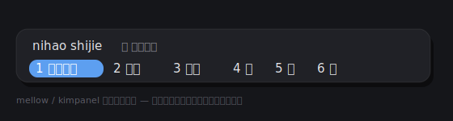

# linux-wayland-chinese-input-method

A battle-tested guide (packaged as a [Claude skill](https://docs.claude.com/en/docs/agents-and-tools/agent-skills/overview)) for getting a **Chinese pinyin input method working on Linux + GNOME Wayland** — using **fcitx5 + Rime** with the **rime-ice (雾凇拼音)** config.

> 在 Linux / GNOME Wayland 上把中文输入法装好的实战记录。搜狗在 Wayland 下闪屏打不出字，这里给出 fcitx5 + Rime/雾凇 的完整替代方案。



## The problem this solves

If you're on **GNOME Wayland** and tried to set up Chinese input, you've probably hit one of these:

- **搜狗 (Sogou) flickers endlessly** and won't let you type — because its Linux build is still fcitx4, which GNOME Wayland doesn't handle.
- **Qt apps can't type Chinese** even after installing fcitx5 — almost always the `IM_MODULE` env-var gotcha (the value must be `fcitx`, *not* `fcitx5`).
- **The candidate window flickers in the terminal** but not in Chrome/Electron apps.
- You got it working but the **candidate popup looks ugly** and you want to theme it.

This guide walks through the whole fix, with every gotcha that cost real time called out.

## What's inside

| File | What it is |
|------|------------|
| [`SKILL.md`](SKILL.md) | The skill itself — concise install + config workflow with frontmatter. |
| [`references/install-walkthrough.md`](references/install-walkthrough.md) | Full annotated 中文 walkthrough, every step + pitfall. |
| [`references/kimpanel-theming.md`](references/kimpanel-theming.md) | How far you can style the candidate popup (kimpanel / St CSS), with a dark rounded baseline. |

## Quick start

The TL;DR (read `SKILL.md` for the full version with explanations):

```bash
# 1. Install fcitx5 + Rime
sudo apt update
sudo apt install -y fcitx5 fcitx5-chinese-addons fcitx5-config-qt \
  fcitx5-frontend-gtk3 fcitx5-frontend-gtk4 fcitx5-frontend-qt5 fcitx5-rime
im-config -n fcitx5

# 2. Env vars — the value is `fcitx`, NOT `fcitx5`
sudo sed -i '/^GTK_IM_MODULE=/d;/^QT_IM_MODULE=/d;/^XMODIFIERS=/d' /etc/environment
printf 'GTK_IM_MODULE=fcitx\nQT_IM_MODULE=fcitx\nXMODIFIERS=@im=fcitx\n' | sudo tee -a /etc/environment

# 3. Install the 雾凇 (rime-ice) config
git clone --depth 1 https://github.com/iDvel/rime-ice.git /tmp/rime-ice
mkdir -p ~/.local/share/fcitx5/rime && cp -r /tmp/rime-ice/* ~/.local/share/fcitx5/rime/
rime_deployer --build ~/.local/share/fcitx5/rime /usr/share/rime-data

# 4. Log out and back in.
```

Toggle the IME with **Ctrl+Space**; switch Rime schema with **Ctrl+`**.

## Using it as a Claude skill

[Agent Skills](https://docs.claude.com/en/docs/agents-and-tools/agent-skills/overview) let Claude pull in this workflow automatically when you ask about Chinese input on Linux. To install for [Claude Code](https://docs.claude.com/en/docs/claude-code/overview):

```bash
git clone https://github.com/Rong-Tao/linux-wayland-chinese-input-method.git \
  ~/.claude/skills/linux-wayland-chinese-input-method
```

Then ask Claude something like *"我在 Ubuntu Wayland 上中文输入法打不出字，帮我装一下"* and it will follow this guide.

## Credits

Built on these open-source projects:

- [Rime / 中州韵](https://rime.im/) — the input method engine
- [rime-ice / 雾凇拼音](https://github.com/iDvel/rime-ice) — the config that makes it feel like Sogou
- [fcitx5](https://github.com/fcitx/fcitx5) — the input method framework
- [fcitx5-mellow-themes](https://github.com/sanweiya/fcitx5-mellow-themes) — the rounded theme

## License

[MIT](LICENSE)
